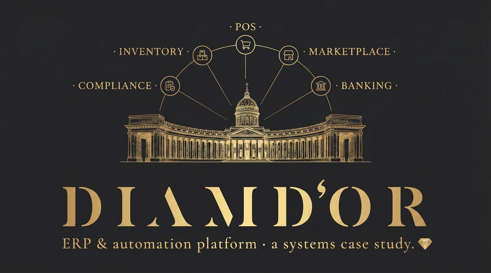
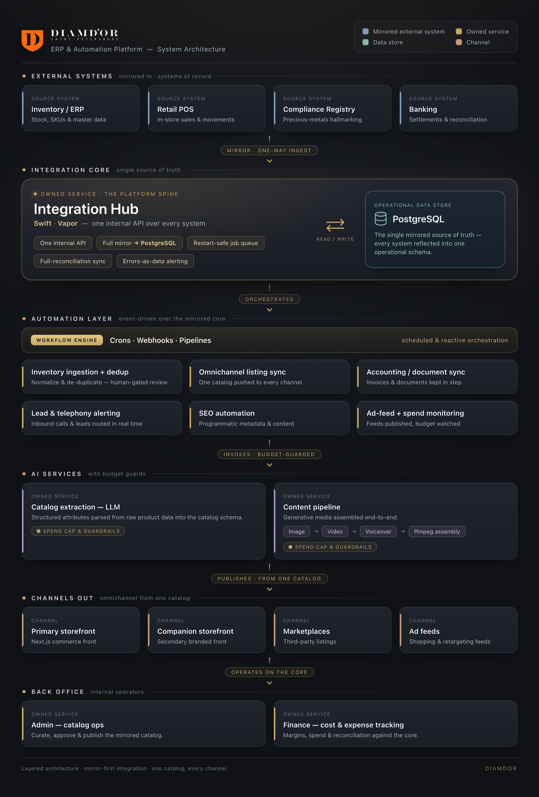

# 💎 Diamdor: a custom ERP & automation platform

### Building the operational backbone for a vertically-integrated jewelry business

> **Scope of this document.** Diamdor is a **live production business**, so this repository contains **no source code, credentials, or business data**. It is an architecture and engineering write-up. Third-party vendors, the regulatory registry, product brands, hosts, and all financial/scale figures are intentionally generalized.

---

## Executive summary

Jewelry retail is one of the most back-office-heavy forms of e-commerce: every item must be richly catalogued, **registered with a state precious-metals authority** before it can be sold, priced against live metal and stone markets, published to a storefront *and* several marketplaces, and reconciled through accounting, across a dozen disconnected third-party systems.

Diamdor runs that entire operation with a **2-3 person team** by replacing the back office with software: an **integration layer** that mirrors every external system into one operational PostgreSQL model, a **workflow-automation layer (n8n)** that turns recurring manual jobs into observable pipelines, and a set of **Next.js** surfaces that publish one catalog across every channel. AI is used where it pays (catalog data extraction and marketing-content generation) as a *bounded cost lever*, not the headline.

I designed and built the platform end-to-end as the sole engineer.

## System at a glance

| | |
|---|---|
| **Pattern** | One internal API + one mirrored operational DB in front of many third-party systems |
| **External systems unified** | Inventory/ERP · Retail POS · Compliance registry · Banking · Marketplaces · Messaging *(generalized)* |
| **Automated workflows** | ~15 pipelines replacing manual back-office tasks (ingestion, listing, accounting, alerting, content, SEO, ad-feeds) |
| **Sales channels from one catalog** | Storefront · companion storefront · marketplaces · ad feeds |
| **Catalog surface** | Thousands of programmatically-generated, SEO-optimized pages |
| **Team** | 2-3 people operating the whole business on the platform |
| **My role** | Sole architect & engineer |

## The problem

Running jewelry retail end-to-end means owning a long, manual operational chain, each step in a different vendor's UI:

- **Sourcing** from multiple channels, each in a different raw format.
- **Cataloging** with rich structured attributes (material, fineness, stone type/shape/carat/grade, dimensions, reference codes).
- **Regulatory compliance:** mandatory state registration with a unique ID at every supply-chain stage; **channels auto-reject non-compliant items**, so compliance gates availability.
- **Pricing** that floats with metal market rates, currency, and per-carat stone tables.
- **Omnichannel publishing** to a storefront, classifieds marketplaces (many accounts), a large marketplace, and ad feeds, each with its own format, image rules, and throttles.
- **Order intake** across web, phone, and marketplace chat, where response speed is a competitive lever.
- **Accounting:** bank reconciliation, supplier receipts, expense tracking by category, periodic reporting, marketplace closing documents.

Done by hand this is a full back-office department. The platform's job is to **collapse all of it behind one API and an automation layer.**

## Architecture

The integration hub shown is the first-generation <b>Swift/Vapor</b> core; the platform's current automation backbone is <b>n8n + TypeScript</b>. See <a href="#a-note-from-the-author">A note from the author</a>.

The diagram above shows the full system. The design has four parts: an **integration hub** (the core), an **operational database** it keeps in sync, an **automation layer** that orchestrates business processes, and the **channels + back-office apps** that operate on top.

### 1. The integration hub: the ERP-grade core *(first generation)*

The platform's first-generation core was a **Swift/Vapor backend**, the single internal API in front of every third-party system. It proved the integration pattern and remains the deepest part of this engineering story, though the current system has moved its automation backbone to **n8n + TypeScript** (see the [closing note](#a-note-from-the-author)). Rather than call vendor APIs live on each operation, it keeps a **full local mirror** of each system in PostgreSQL and exposes uniform endpoints, turning a mess of disconnected systems into one coherent operational model.

| Function consolidated | What the hub does |
|---|---|
| **Inventory / ERP** | Bidirectional mirror of assortment, receipts, shipments, and stock postings; cursor-paginated pulls; parallel document sync via structured concurrency |
| **Retail POS** | Full product-catalog mirror |
| **Marketplace** | Generates the bulk-listing feed served to a marketplace crawler; creates/updates/archives ads; caches images; pulls back per-listing stats & reports |
| **Pricing** | Recomputes stone prices from live market + currency inputs against a per-carat table |
| **Compliance** | Mirrors item records + unique IDs from the state registry; **gates channel availability** on compliance status |
| **Banking** | Mirrors transactions & counterparties as the reconciliation source |
| **Labeling / reporting** | LLM-generated structured label text; DB-backed scheduled jobs emit balance/sales/marketing digests + error alerts |

### 2. The automation layer

A self-hosted **workflow engine** orchestrates business processes as inspectable pipelines (crons, webhooks, human-approval gates). Each retires a manual job: inventory ingestion with source-dedup and a human review gate; omnichannel listing sync with per-account throttles, promotion scheduling, and tiered spend alerts; large-marketplace sync via barcode matching; accounting/document sync (headless-browser document download + checksum verification); lead & telephony alerting with race-safe acknowledgment; SEO automation; and ad-feed generation with spend monitoring.

### 3. Back office & channels

- **Admin app** (Next.js): operational control over the catalog; edits propagate downstream via webhook.
- **Finance app** (React/Vite): category-level expense and **jewelry production-cost** tracking (stones, gold, casting, plus per-contractor ledgers), with each SKU linked to its cost tracks and inventory positions.
- **Omnichannel from one record:** an `origin`-tagged catalog record is authored once and syndicated to the storefront, a companion storefront, marketplaces, and ad feeds, with per-channel formatting and imagery handled automatically.

## Selected engineering deep-dives

**Keeping one model in sync with many systems.** Each integration runs a **full-reconciliation cycle** (upsert *and* delete) so the local DB stays a faithful mirror; pulls are cursor-paginated and idempotent (safe to re-run), and documents within a sync fan out via **structured concurrency**. Operations then read one fast local model; vendor latency and rate limits stay out of the hot path.

**Restart-safe automation without a broker.** Scheduled sync and report jobs run on a **DB-backed persistent queue** (no Kafka/Redis/RabbitMQ to operate), appropriate for a lean self-hosted setup. Every integration writes failures to its own **error-log table**, drained by alerting jobs, so a broken sync becomes a visible work item instead of a silent gap.

**Compliance engineered into the publish path.** Because channels auto-reject unregistered items, registry status is a **first-class field** the listing pipelines check before publishing; non-compliant items are pushed as zero-stock or skipped, with unmatched-SKU alerts surfaced to staff.

**Bounded AI cost.** Generation runs behind **budget guards** (paid model calls fire only on explicit triggers, only free status checks run on cron, and a usage log audits spend) while catalog extraction leans on prompt caching to keep per-item cost negligible.

## Design decisions & tradeoffs

| Decision | Why | Tradeoff accepted |
|---|---|---|
| Custom hub over off-the-shelf ERP | Exact fit for this mix of marketplaces, the registry, and AI; no per-seat cost | Build & maintain the integrations myself |
| Mirror everything vs. live API calls | Fast local reads; resilient to vendor downtime/limits | Sync lag; reconciliation complexity |
| DB-backed queue vs. message broker | No extra infra; restart-safe; simple to operate | Not built for very high throughput |
| Typed Swift integration core | Safe many-system integration; legible concurrency | Smaller ecosystem than Node for this layer |
| One catalog record, fan-out to channels | Author once, stay consistent everywhere | Per-channel formatting logic |
| AI behind budget guards | Scale content cheaply without runaway cost | Added orchestration |

## Outcomes (qualitative)

Documented effects, figures withheld:

- **Throttled budget control beat on/off promotion:** moving paid promotion from binary on/off to throttle-based budgeting reached a record contact-volume milestone at *lower* spend.
- **A cost-per-lead metric drove reallocation:** introducing cost-per-lead across channels produced a measured difference that became the basis for a budget-reallocation decision.
- **AI cataloging replaced manual data entry:** the full candidate backlog was structured in under an hour at very low per-unit cost.
- **Leverage, not layoffs:** the goal and the result is a tiny team operating across many channels and systems that would normally need a back office.

## Roadmap: what I'd evolve next

- Move remaining poll-based steps to **event-driven** sync (DB change streams / a broker) as volume grows.
- Add **service-to-service auth** across the internal mesh (today it leans on network trust).
- Fold the spreadsheet-as-source-of-truth fully into the CMS/DB.
- **CI/CD** over build-on-host, with a least-privilege deploy path.
- **Observability:** metrics and tracing across the workflow layer.

## Tech stack

| Layer | Technology |
|---|---|
| **Integration hub** *(first generation · legacy)* | Swift · Vapor · Fluent · Vapor Queues · structured concurrency |
| **Data** | PostgreSQL (operational mirror) · headless CMS + object storage (assets) |
| **Storefronts / back-office** | Next.js (React 19, hybrid static/SSR) · React + Refine · React + Vite · Tailwind · Zod |
| **Automation / AI** *(current)* | **n8n** workflow engine · **TypeScript / Node** microservices · headless-browser automation · ffmpeg/ffprobe · generative image/video/voiceover models · LLM extraction (prompt caching) |
| **Infra** | Docker · self-hosted PaaS · reverse proxy · secured tunnels |

## A note from the author

I've been building Diamdor for about **five years**, and the honest story of this system is also a story of changing my mind.

When I started, I wrote the entire backend in **Swift with Vapor**. I love Swift, and building a full ERP-grade integration layer in a strongly-typed, server-side Swift stack was genuinely *fun*, an ambitious experiment as much as an engineering decision. It taught me most of what I know about integration architecture: pulling a dozen messy third-party systems behind one typed API is hard, and doing it in Swift made me earn every abstraction.

But five years of running a *real business* on it taught me the other half of the lesson. For this kind of work (gluing systems together, moving fast, automating back-office processes), server-side Swift was a beautiful experiment, not the pragmatic choice. The ecosystem, the iteration speed, and the tooling all pointed elsewhere.

So today the platform runs on **TypeScript**, with **n8n** as the automation backbone, and the Swift/Vapor hub is **legacy**. I keep it in this case study on purpose: it's part of how I got here, and the architecture it proved still holds. But if I were starting over, I'd reach for TypeScript and a workflow engine from day one.

That shift, from *"what's fun to build"* to *"what's right to run"*, is probably the most valuable thing these five years have taught me.

## Author

**Alex Polezhaev**, full-stack & systems engineer. I design and build operational platforms end-to-end: integration backends, automation, and the apps on top. **Relocating to the United States, open to roles.**

- GitHub: [@alex-polezhaev](https://github.com/alex-polezhaev)
- Email: polezhaev.advert@gmail.com

---

Architecture case study of a live system. No proprietary code, credentials, customer data, vendor names, or financial figures are included. Deeper component breakdown: [`docs/architecture.md`](docs/architecture.md).
