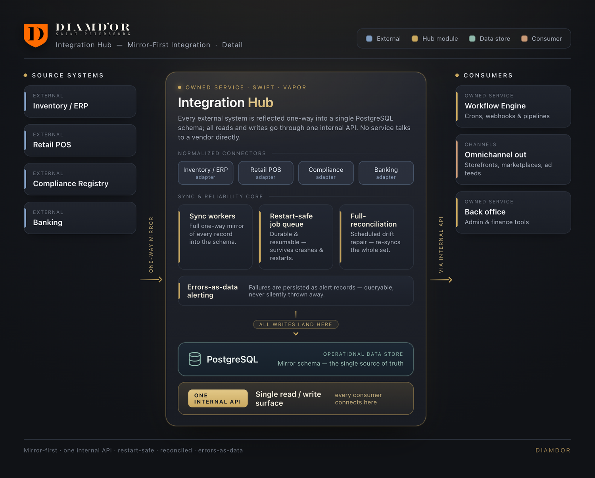

# Architecture: component & operations breakdown

> A sanitized, high-level view of a live production system. Generic roles only; no vendors, registry/authority names, hosts, credentials, brands, or figures.

## Two generations, one direction

The platform evolved in two stages with a consistent goal, **one operational model behind one API**:

1. **Integration hub (Swift/Vapor), now legacy.** Proved that many third-party systems could be unified behind a single typed internal API, mirrored into one database, with restart-safe scheduled automation.
2. **Automation monorepo (current).** Generalized the hub into a self-hosted **TypeScript** microservice system with **n8n** as the orchestration glue, and added the AI cataloging/content pipelines and the omnichannel storefronts.

## Components

| Component | Role | Core tech |
|---|---|---|
| **Integration hub** | Single internal API over ERP / POS / marketplace / registry / banking; mirrors all of it into one operational DB; restart-safe job queue | Swift · Vapor · Fluent · Vapor Queues |
| **Operational database** | The mirrored source of truth for assortment, documents, pricing, compliance, transactions | PostgreSQL |
| **Workflow automation engine** | Orchestrates ingestion, listing sync, accounting, alerting, content, SEO, as inspectable flows | Self-hosted workflow engine |
| **Headless CMS + object storage** | Catalog/content assets feeding the storefronts | Headless CMS · S3-style storage |
| **AI cataloging** | Batched LLM extraction of messy multi-source product data into a strict schema, behind a human review gate | LLM (prompt caching) |
| **AI content pipeline** | Submit-and-poll image / video / voiceover generation + media assembly | Node microservices · ffmpeg · headless browser |
| **Admin app** | Operational control over the catalog; edits propagate via webhook | Next.js |
| **Finance app** | Category-level expense & production-cost tracking | React · Vite |
| **Primary + companion storefronts** | Omnichannel publishing surfaces from one catalog | Next.js (React 19) |

## The operational loop (data flow)

1. **Source in.** Products arrive from multiple channels, are deduplicated by `origin`, and land as candidates.
2. **Structure.** Batched LLM extraction parses candidates into a strict `products → variants → media` schema; a human gate promotes approved items.
3. **Comply.** Items are registered/mirrored against the precious-metals registry; compliance status is attached and **gates channel availability**.
4. **Price.** The pricing engine recomputes stone prices from live market + currency inputs against a per-carat table.
5. **Publish.** The catalog fans out to storefronts (ISR), classifieds + large marketplaces (generated feeds, per-channel uniqueness), and ad feeds.
6. **Capture.** Orders/leads arrive via web, phone, and marketplace chat; lead alerting routes them to managers with race-safe acknowledgment.
7. **Reconcile.** Banking, supplier documents, and marketplace closing documents mirror in; expenses and production costs are tracked by category in the finance app.

## Integration-hub patterns worth calling out

- **Mirror everything.** Rather than call third-party APIs live on every operation, the hub keeps a **full local mirror** of each system and reconciles it on a cycle (upsert + delete). Operations read one fast local model; external latency and rate limits stay out of the hot path.
- **Restart-safe queue without a broker.** Scheduled sync/report jobs run on a **DB-backed persistent queue**, so there's no Kafka/Redis/RabbitMQ to operate, appropriate for a lean, self-hosted setup.
- **Errors as data.** Each integration writes failures to its own **error-log table**, drained by alerting jobs, so sync breaks and channel rejections become visible work items, not silent gaps.
- **Compliance as a gate, not a footnote.** Because channels auto-reject non-compliant items, compliance status is a first-class field that the listing pipelines check before publishing.
- **One record, many channels.** The `origin`-tagged catalog record is authored once and syndicated everywhere, with per-channel formatting and image handling applied automatically.

## Design decisions

- **Custom hub over off-the-shelf ERP.** A commercial ERP wouldn't speak to this mix of marketplaces, the registry, and the AI pipelines without heavy customization anyway; a focused internal API was cheaper to build and own, and fits the exact operation.
- **Typed backend for the integration core.** Swift's type system + an async ORM made the many-systems mirror and the structured-concurrency document sync safe and legible.
- **Workflow engine for the process layer.** Business processes live as inspectable visual flows (with crons, webhooks, and human gates) rather than scattered scripts: easy for a non-technical operator to reason about.
- **AI as a bounded cost lever.** Generation runs behind budget guards and a usage log; cataloging leans on prompt caching to keep per-item cost negligible.

## What this case study deliberately omits

Real domains/hosts/IPs and webhook URLs; all credentials, API keys, and tokens; the specific ERP / POS / marketplace / ad / telephony / messaging / CMS / AI-model vendors; the regulatory registry and authorities by name; the product brands and product positioning; customer and staff PII; and every financial, pricing, and exact-scale figure, none of which are needed to convey the engineering.
